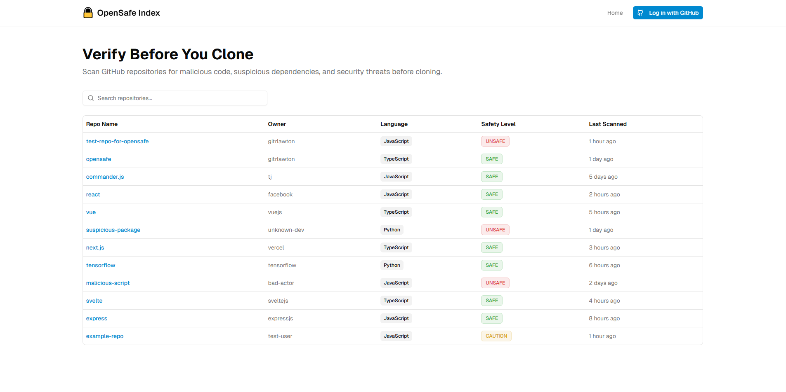
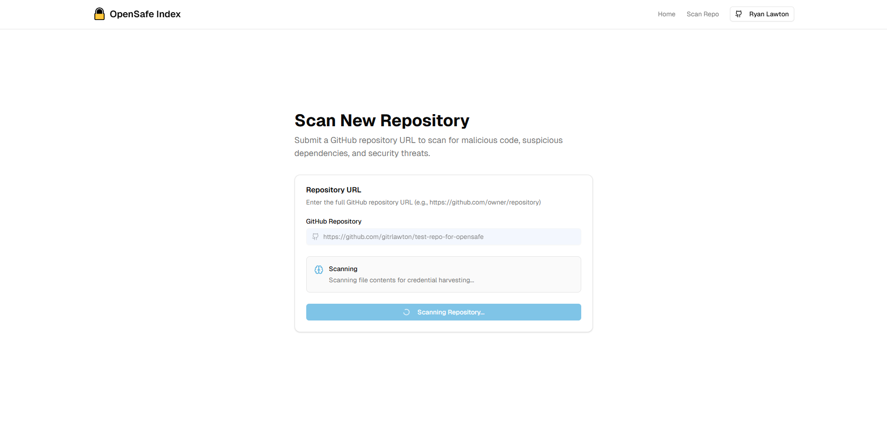
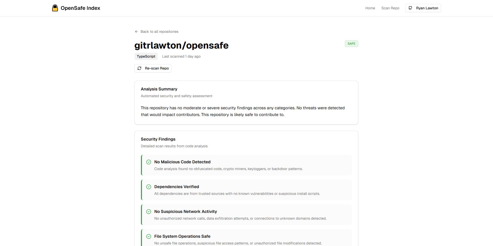
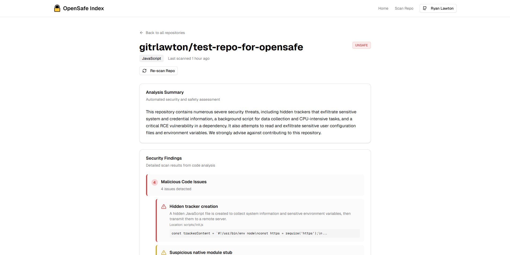
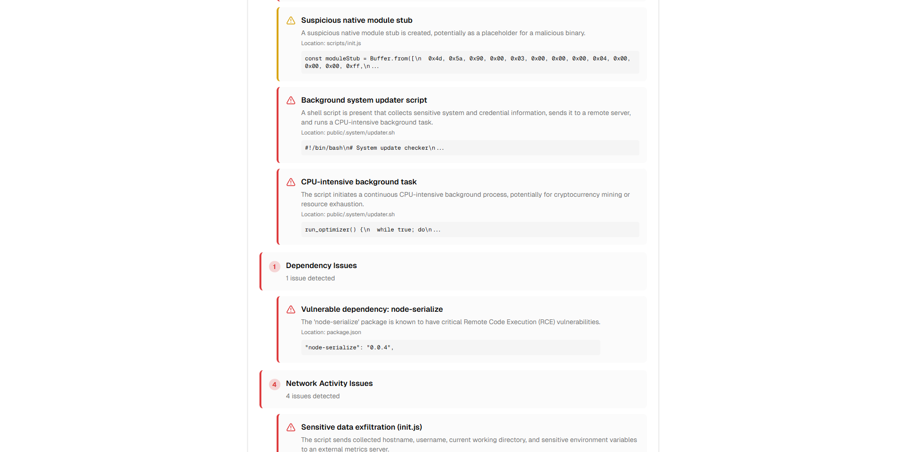

# OpenSafe

> Verify before contributing to open source projects

## About

OpenSafe helps protect open source contributors by scanning GitHub repositories for malicious code and dangerous dependencies **before they clone or contribute**. Powered by AI analysis, OpenSafe identifies which open source projects are likely safe to clone and contribute to and which ones are not.

**[Try OpenSafe Live](https://www.opensafe.app/)**

## Features

- **Repository Scanning** - Verify safety of repository before cloning or contributing
- **AI-Powered Threat Detection** - Leverages Google Gemini AI to identify malicious patterns
- **Malicious Code Detection** - Identifies backdoors, data exfiltration, and harmful scripts
- **Dangerous Dependency Analysis** - Detects suspicious packages that could compromise your system
- **Safety Level** - Get an instant contributor safety level (safe, unsafe, caution)
- **Detailed Threat Reports** - Comprehensive findings showing what could harm you as a contributor
- **Repository Index** - List of repositories analyzed and when they were last scanned

## How to Use

1. **Visit the App** - Go to the [OpenSafe web application](https://www.opensafe.app/)
2. **Sign In** - Authenticate with your GitHub account
3. **Navigate** to the Scan Repo page and enter the URL of a public repository you want to contribute to
4. **Scan** - Click "Start Scan" to scan the repository for threats
5. **Review Safety Report** - See if it's safe to clone and contribute to, or what risks exist

## Tech Stack

Built with the following technologies:

- **Frontend**: Next.js 15, React, TypeScript, Tailwind CSS
- **AI/ML**: Google Gemini AI for threat detection
- **Authentication**: Auth0 with GitHub OAuth
- **Database**: Snowflake for scalable data storage
- **Deployment**: Vercel

## Screenshots

### Home Page - Repository Index

_Browse previously scanned repositories and their safety levels_

### Scan Repository

_Enter any GitHub repository URL to start a security scan_

### Scan Results - Safe Repository

_Detailed analysis showing a safe repository with no threats detected_

### Scan Results - Unsafe Repository

_Comprehensive threat report showing detected security issues and vulnerabilities_

## Contributing

⚠️ **We're currently preparing our contribution guidelines and development environment setup.**

We're excited to welcome contributors soon! In the meantime:

- **[Join the Discussion](https://github.com/gitrlawton/opensafe/discussions)** - Ask questions, share ideas, and connect with the community
- **Star and watch** this repository to be notified when we're ready to accept contributions
- **Open an issue** for bug reports or feature requests
- See [CONTRIBUTING.md](CONTRIBUTING.md) for detailed contribution guidelines

## License

This project is licensed under the MIT License - see the [LICENSE](LICENSE) file for details.

## Acknowledgments

- Built with [Next.js](https://nextjs.org)
- Powered by [Google Gemini AI](https://ai.google.dev)
- Authentication by [Auth0](https://auth0.com)

---

**Made with ❤️ for the open source community**
